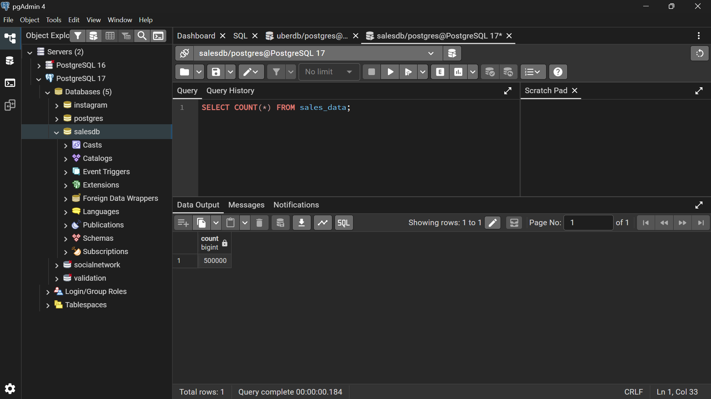
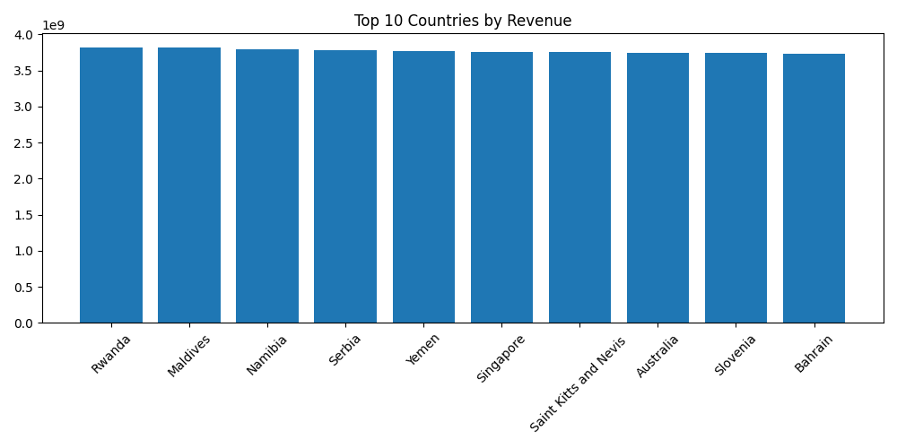
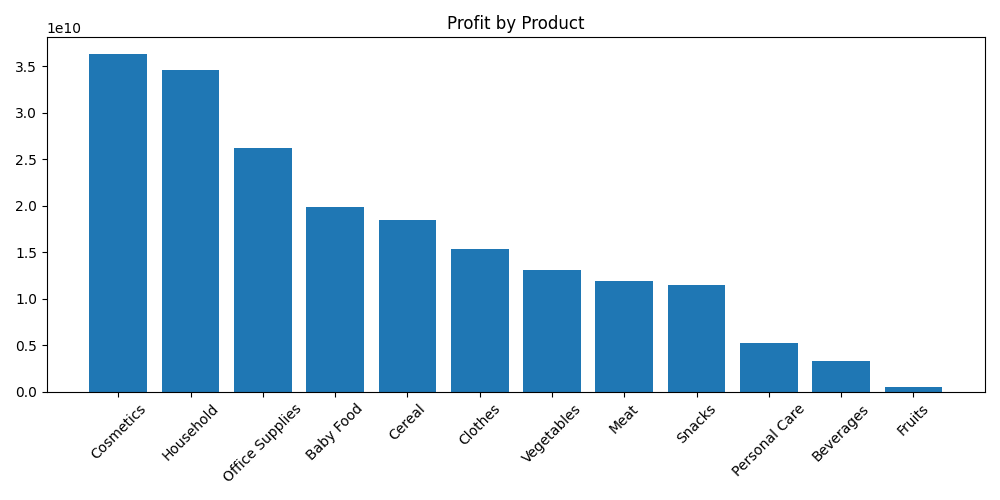
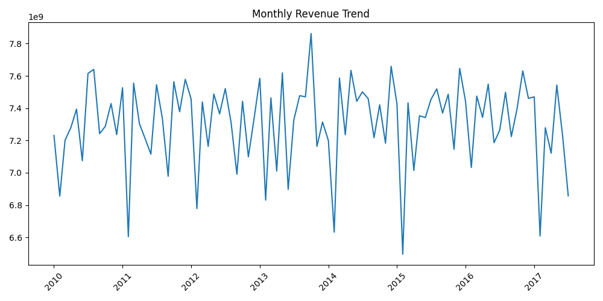

# Retail Sales Analytics & ETL Pipeline

## Overview

Built an end-to-end ETL pipeline processing 500,000 retail sales records using Python and PostgreSQL.

## Dataset Statistics

- Total Records: 500,000
- Missing Values: 0
- Duplicate Records: 0

---

## PostgreSQL Verification

---

## Top Countries by Revenue

---

## Product Profit Analysis

---

## Monthly Revenue Trend

---

## Technologies

- Python
- Pandas
- PostgreSQL
- SQLAlchemy
- Matplotlib

## Features

- Data ingestion from CSV
- Data validation
- PostgreSQL integration
- SQL analytics
- Revenue analysis
- Profit analysis
- Automated report generation
- Business visualizations

## Dataset

500,000 retail sales transactions with:

- Region
- Country
- Product Type
- Sales Channel
- Revenue
- Cost
- Profit

## Outputs

- Revenue Trend Chart
- Top Countries Chart
- Product Profit Chart
- Automated Sales Report
